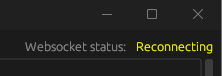
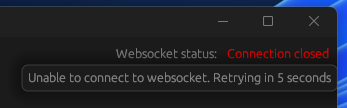
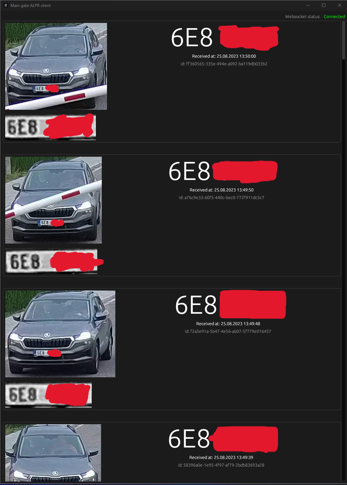
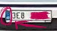
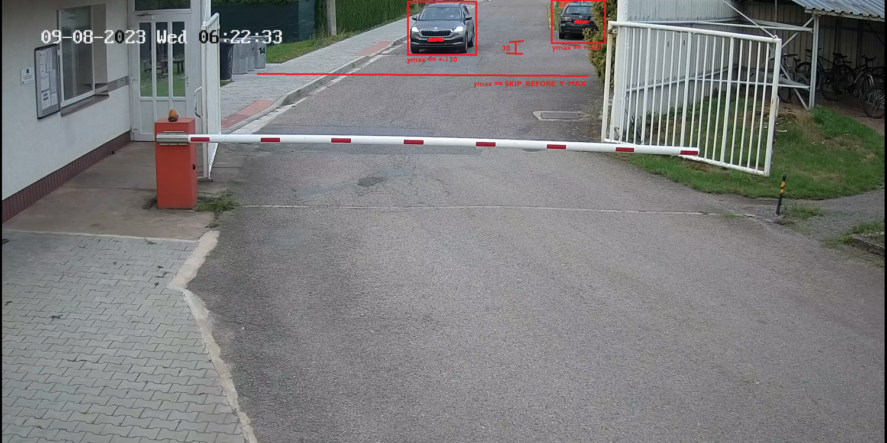
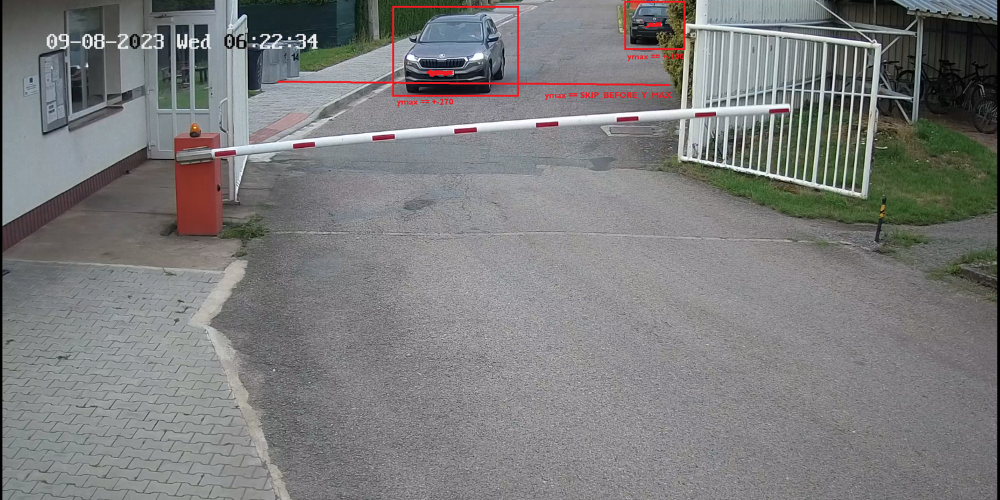

# Main Gate ALPR

TODO: Table of contents

# Showcase

TODO

# How does it work?

This is just a high level explanation, if you want more in-depth understanding, read the [env config](#how-to-configure-env) + source code :D

1. When you start the web server, all env variables and ai models all loaded into memory.
2. If you enabled result saving, the directory for resutls will get created
3. Two threads get spin up,
   - First one reads frames from the IP cam / video and ensures to always be connected to the input source. If you're running in DEBUG, you'll see a window from the camera.
4. Second one get's latest frame and passes it to pure yolo.
5. After analyzing, the program crops all cars into array and checks whether you're not far enought
6. After that, it passes the cropped image to fine-tuned yolo for license plates.
7. The license plate gets cropped and pre-precossed (more inside `./utils.py`)
8. Then the license plate get's separated into each character which gets passed to tesseract while using all possible threads
9. License plate value gets finalized and validated ([more on the validation](#how-to-configure-env))
10. Licese plate and cropped car gets sent to all websocket connected clients.
    - and optionally saved into DB/Results dir, based on your .env

# How to setup

## Prerequisites

- python 3.11.2
- docker (optional, in case you need db for local dev)
- rust (optional, in case you want to try-out the example provided client, however if you connect to the websocket server through postman, it will be enough)

1. Go into `./ai/resources` folder
2. ```
   cat yolov8m_* > yolov8m.pt
   cat yolov8l_* > yolov8l.pt
   cat yolov8x_* > yolov8x.pt
   cat andrewmvd_dataset_* > andrewmvd_dataset.zip
   cat aslanahmedov_dataset_* > aslanahmedov_dataset.zip
   cat tdiblik_lp_finetuned_yolov8m_* > tdiblik_lp_finetuned_yolov8m.pt
   cat tdiblik_lp_finetuned_yolov8l_* > tdiblik_lp_finetuned_yolov8l.pt
   cat tdiblik_lp_finetuned_yolov8x_* > tdiblik_lp_finetuned_yolov8x.pt
   cp yolov8*.pt ..
   ```
3. Go back into root folder
4. `pip install torch torchvision torchaudio --index-url https://download.pytorch.org/whl/cu118`
   - or equivalent, [based on your system configuration](https://pytorch.org/#:~:text=Aid%20to%20Ukraine.-,INSTALL%20PYTORCH,-Select%20your%20preferences)
5. Install [tesseract](https://tesseract-ocr.github.io/tessdoc/Installation.html)
6. `pip install -r requirements.txt`

## Start the websocket and matching server

1. Go into `./server`
2. Copy `.env.development` to `.env`
3. [Setup env](#how-to-configure-env)
4. Setup db server (optional, depends on your `.env`)
   1. Make sure you're following Microsoft's licensing requirements, since the DB I chose is MSSQL. I did this because it's already integrated at my workplace. Personally, I use the docker only for development / testing.
   2. Go back into root folder.
   3. ```
      # (on Windows replace `pwd` with `pwd -W`)
      docker run -e "ACCEPT_EULA=Y" -e "MSSQL_SA_PASSWORD=MyV€ryStr0ngP4ssW0rĐ" \
       -p 1433:1433 --name main_gate_aplr_db --hostname main_gate_aplr_db \
       -v $(pwd)/db/data:/var/opt/mssql/data \
       -v $(pwd)/db/log:/var/opt/mssql/log \
       -v $(pwd)/db/secrets:/var/opt/mssql/secrets \
       -d mcr.microsoft.com/mssql/server:2022-latest
      ```
   4. `docker exec -it main_gate_aplr_db "bash"`
   5. `export QUERY_TO_EXECUTE="{CONTENTS_OF_./db/init.sql}"`
   6. `/opt/mssql-tools/bin/sqlcmd -S localhost -U SA -P "MyV€ryStr0ngP4ssW0rĐ" -Q "$QUERY_TO_EXECUTE"`

## Start the example client (optional)

1. Go into `./client`
2. Make sure variable `WEBSOCKET_URL` is set up correctly inside `./client/src/main.rs` based on your server's `.env` (sorry, I was too lazy to implement env config only because of this one variable)
3. Run `cargo r`
4. You should see one of the following states
   - Client can be trying to connect
     - 
   - Client can be disconnected (hover over for more info)
     - 
   - Or working as intended! (if you setup everything correctlly)
     - 

## Train your own model (optional)

1. Go into `./ai` folder
2. `export PYTORCH_CUDA_ALLOC_CONF=max_split_size_mb:512` (on Linux) or `set PYTORCH_CUDA_ALLOC_CONF=max_split_size_mb:512` (on Windows)
3. `python prepare.py`
4. Go into `train.py` and configure which pre-trained model you want to use.
5. `python train.py`
   - If you encounter an error with path, running the program again will probably solve it. For some reason (ultralytics related ¯\_(ツ)\_/¯) it sometimes failes on first launch in new directory. If your error persists, open a new issue.
   - If you run out of GPU memory, or encounter any error while training, play around with the `batch` variable. On my RTX 3070 Ti, 16 batches for smaller models (n/s/m) is enought, however for larger models (l/x), I had put the batches down to 8

## Test your/provided models visually (optional)

1. Go into `./ai` folder
2. Run the following command: `python test.py {path_to_your_or_provided_model} {path_to_image_to_test_on}`

## How to configure env

You can find example config at `./server/.env.development`

### Base (change behavior in noticable way)

- DEBUG
  - if you want to see debug information, set the value to `True`.
  - This will not only show logs, open window where you can see the video feed, but also save intermediate files while matching, so you can inspect them, into `./server/intermediate_detection_files`
  - if you want to disable this, just remove the option or set it to any other value than `True`
- WS_PORT
  - **required**
  - Determines the port of the web socket server.
- RTSP_CAPTURE_CONFIG
  - **required**
  - Video input for matching.
  - This can be either a custom video, in that case, specify the file path (eg. `"./input.mp4"`), or RTSP path (eq. `"rtsp://{username}:{password}@{ip}:{port_probably_554}/Streaming/channels/1/"`). You can find probably find RTSP config info at the following path of your IP cam (`http://{ip}:{port_probably_80}/Streaming/channels/1/`). If you're unable to find the config, try changing around the channels part of url (eq. `1/2/3,...`).
  - If you're not sure whether you've configured this variable correctlly, go into `./server` and run `python test_rtsp.py`. It will use your `.env`, just as the web server would and provide you with visual feedback.
- PURE_YOLO_MODEL_PATH
  - **required**
  - Pure unedited yolo(v8) model is used for car recognition.
  - As long as it's yolov8, it does not matter, which type (n/s/m/l/x) you choose. To save you some time, you can find the models at `./ai/resources/yolov8*.pt`.
  - Example value could like `"../ai/resources/yolov8n.pt"`
- LICENSE_PLATE_YOLO_MODEL_PATH
  - **required**
  - Fine-tuned model path used for matching license plates.
  - I have fine tuned every single version of yolo already, so you don't have to. You can find it under `tdiblik_lp_finetuned_yolov8*.pt` (where `*` represents the model type)
- DB_ENABLED
  - if you want to insert results into database, set this value to `True`.
  - If you set this value to `True`, make sure to follow db-setup guide.
  - You can find db schema at `./db/init.sql`. Only `id`, `license_plate` and `captured_at` fields are required for the web socket server to work, however since this server is used as a part of proprietary solution, I just included the whole schema as is in the proprietary solution :D. Feel free to edit it to fit your usecase.
  - if you want to disable this, just remove the option or set it to any other value than `True`
  - If you enable DB, all of the following env options are considered as **required**
  - DB_SERVER
    - Sql server IP / DNS alias (eg. `localhost`)
  - DB_PORT
    - You probably want to set the value to `1433` since that is default MSSQL port.
  - DB_NAME
    - Name of the database to use inside your database server
    - If you used the `./db/init.sql`, you want to set this value to `lpdb`
  - DB_USER
    - Database user to use
    - If you used the docker setup command, or didn't change defaults (not recommended), you want to set this value to `SA`
  - DB_PASSWORD
    - Password of the database user
    - If you used the docker setup command, you want to set this value to `MyV€ryStr0ngP4ssW0rĐ`
- SAVE_RESULTS_ENABLED
  - if you want to save car and license plate images matched, set this value to `True`.
  - if you want to disable this, just remove the option or set it to any other value than `True`
  - If you enable saving results, all of the following env options are considered as **required**
  - RESULTS_PATH
    - Path where to save results (will be created if not exists)
    - Eg. `"./results"`
- SHOULD_SEND_SAME_RESULTS
  - Once a license plate is matched, there's a check on whether to send the result. Basically, if the program already sent license plate value, same as the one currentlly matched, in the last 5 minutes, the license plate matched will get ignored.
  - if you want to enable this behavior (default), just remove the option or set it to any other value than `True`
  - if you want to disable this behavior and process all matches, set this value to `True`.

### Custom tweaks (tinkering with these can become a silent problem, if you don't know what you're doing)

- SHOULD_TRY_LP_CROP
  - Some models may have problems where they recognize the part next to license plate as a part of license plate (see picture below)
  - If you encounter this behavior from your models, set this value to `True` and this will try to programatically cut that part out.
  - Otherwise, just remove the option or set it to any other value than `False`
  - 
- MINIMUM_NUMBER_OF_CHARS_FOR_MATCH
  - You probably want to set this value to default `4` (shortest license plate in Europe)
  - Basically, if you match a license plate, however you're unable to find more then MINIMUM_NUMBER_OF_CHARS_FOR_MATCH of contours (pre-precessed, cropped, single characters of license plate), there is no reason to try reading it (and wast CPU time/cycles), since the license plates won't be valid anyway. So, the smart decision is just to skip it.
  - If you didn't understand the previous sentece, but want to tinker with it anyway, just set it to the minimum number of characters license plate has to contain for it to be a match.
- NUMBER_OF_VALIDATION_ROUNDS
  - You probably want to set this value to default `3`
  - So, the quality of the camera can be bad and the ai's don't work correctlly 100% of the time. That's why there's the NUMBER_OF_VALIDATION_ROUNDS variable. Basically, the entire matching process output is saved to intermediate array that get's filtered (filtering affected by NUMBER_OF_OCCURRENCES_TO_BE_VALID) every Nth run, and after that, the results are sent/saved/etc. If you want to see how the filtering works, check out `./server/server.py`, function `validate_results_between_rounds`
  - Also, if you set NUMBER_OF_OCCURRENCES_TO_BE_VALID > NUMBER_OF_VALIDATION_ROUNDS, then you will never match any license plates :D
- NUMBER_OF_OCCURRENCES_TO_BE_VALID
  - You probably want to set this value to default `2`, or, if you tinkered with NUMBER_OF_VALIDATION_ROUNDS, you probably want it to be `NUMBER_OF_VALIDATION_ROUNDS - 1`
  - Inside the intermediate array, how many times the license plate number has to occur for it te be considered valid and pass validation. If you want to see how the filtering works, check out `./server/server.py`, function `validate_results_between_rounds`
- SKIP_BEFORE_Y_MAX
  - This is a tricky one, however probably the most important one, while tinkering. Ok, when we find a car in a picture, we can assume that if it's too far from the top of the picture, the license plate is not readable, hence we can ignore that car and not waste CPU time/cycles.
  - `ymax` is the bottom line of matched car.
  - Let's see this in practice, on the following picture, none of the cars will get matches, because we can assume that the car is far enought, for the license plate to be messy and not readable.
    
    in this picture, both cars are far and we can assume that reading the license plate will be a waste of time.
  - However, in the following picture, one of the cars is close enought for the license plate to be readable, and therefore it's not ignored.
    
  - This optimization enables us to only run car detection and optionally skip license plate detection and OCR phase. This speeds up the program A LOT and even provides better results, because we ignore "trash" data.

# Development Notes

- When adding stuff into resources, for anything over 25MB, use the following command: `split -b 25M --numeric-suffixes <name> <name>_` and add proper documentation on how to build it back together after clone.
- If you see `lp` alias inside code, it's probably shorthand form of `license plate`

# Acknowledgements

## ./ai/resources/yolov8\*

Yolo models were downloaded from the [ultralytics repository](https://github.com/ultralytics/ultralytics). I was unable to find any documentation on how to credit them, please, if you do, please send a pull request.

## ./ai/resources/andrewmvd_dataset.zip

```
BibTeX
@misc{make ml},
title={Car License Plates Dataset},
url={https://makeml.app/datasets/cars-license-plates},
journal={Make ML}
```

I downloaded the following [kaggle dataset](https://www.kaggle.com/datasets/andrewmvd/car-plate-detection).

## ./ai/resources/aslanahmedov_dataset.zip

I downloaded the following [kaggle dataset](https://www.kaggle.com/datasets/aslanahmedov/number-plate-detection). The original author is [ASLAN AHMEDOV](https://www.kaggle.com/aslanahmedov), however the sources cited are "web scraping"

## General

- While learning, the following freeCodeCamp article was realy helpful to get started: [How to Detect Objects in Images Using the YOLOv8 Neural Network](https://www.freecodecamp.org/news/how-to-detect-objects-in-images-using-yolov8/) - [Andrey Germanov](https://www.freecodecamp.org/news/author/germanov_dev/)
